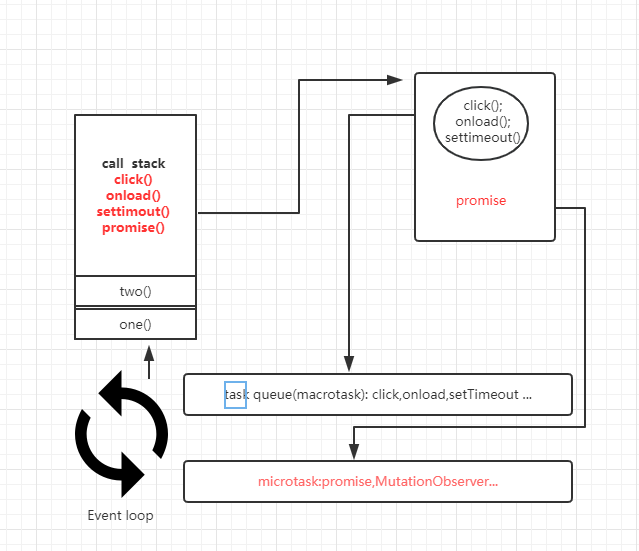

# 关于 Event loop Task queue microtask macrotask
从Html规范的角度去看Event loop,本篇仅仅描述在浏览器环境下的event loop 不包含node环境。
## Event loop
根据HTML规范中定义的：
> 8.1.4 Event loops  
  8.1.4.1 Definitions  
  To coordinate events, user interaction, scripts, rendering, networking, and so forth, user agents must use event loops as described in this section. Each agent has an associated event loop.

简单来说就是负责协调在一个浏览器页面中的事件，用户交互（click..input），脚本，渲染，网络请求等我们所熟知的东西。背后都是通过Event loop在协调运做。
## Task queue
一个event loop有多个task队列。不同任务要放入不同的任务队列。比如鼠标和键盘的用户交互为一个队列。而settimeout等又是一个队列。可以适当优先的先处理鼠标键盘的队列以保证用户交互的流畅。
一个task queue就是一个先进先出的队列，由指定的任务源去提供任务；
以下为可以为task队列提供的任务的任务源：
> 8.1.4.4 Generic task sources  
  The following task sources are used by a number of mostly unrelated features in this and other specifications.  
  The DOM manipulation task source
  This task source is used for features that react to DOM manipulations, such as things that happen in a non-blocking fashion when an element is inserted into the document.  
  The user interaction task source
  This task source is used for features that react to user interaction, for example keyboard or mouse input.  
  Events sent in response to user input (e.g. click events) must be fired using tasks queued with the user interaction task source. [UIEVENTS]  
  The networking task source  
  This task source is used for features that trigger in response to network activity.  
  The history traversal task source
  This task source is used to queue calls to history.back() and similar APIs.

基本上是我们常用的任务来源。比如DOM操作，用户交互任务源（click),网络任务源（ajax），还有诸如，onload,settimeout,setInterval,等常用的都是task任务源。
## Microtask
每个event loop都有一个microtask,一个microtask任务会被排进microtask而不是task queue,microtask队列和task队列一样，不同的是每个 event loop只有一个microtask。
通常microtask的任务来源有：
* process.nextTick
* promise
* Object.observe
* MutationObserver

## event loops在哪？
有两种event loops 一个种是在浏览器的上下文中。一种是在workers  
所谓浏览器上下文就是一个将Document对象呈现给用户的环境。在日常使用种一个浏览器的标签页窗口就是一个上下文。每个标签页都有一个独立的event loops。  
一个worker对应一个event loop，worker进程模型管理event loop的生命周期。

## Event loop 处理过程
根据规范8.1.4.3Processing model(https://html.spec.whatwg.org/multipage/webappapis.html#event-loop-processing-model)  
一个event loop会不断执行如下步骤：  
1. 在task队列中选择最老的一个task，用户代理可以选择任务一个task队列。如果没有任务可以选则直接
2. 将选中的task设置为 evetn loops的currently running task.
3. 运行 currently running task。
4. 运行完成后将 currently running tasks设置为Null.
5. 从task队列里移除刚才运行的task
6. Microtask: 执行microtask任务检查点。（执行microtask任务）
7. 更新渲染
8. 如果这是一个worker event loop，但是没有任务在task队列中，并且WorkerGlobalScope对象的closing标识为true，则销毁event loop，中止这些步骤，然后进行定义在Web workers章节的run a worker。
9. 返回第一步

event loop会不断重复上述步骤。  
* event loop 会不断循环去取task queue队列中取最先进入的任务，执行完后。在当此循环中执行并清空microtask里的任务。
* 执行完microtask队列里的任务，有可能会渲染更新。（浏览器很聪明，在一帧以内的多次dom变动浏览器不会立即响应，而是会积攒变动以最高60HZ的频率更新视图）

## 什么时候执行microtask
根据上面的规范执行microtask的时机就是:
* 当前task执行完。执行栈为空。
* 在更新渲染之前。
## 执行栈
Javascript是一个单线程，就也是只有一个主线程。主线程有一个栈，每执行一个新的函数时会将改函数推入栈中，栈也就执行栈（执行上下文）包含了当前执行函数的参数，局部变量。作用域等信息。当函数执行完后就会从它的执行栈中退出。
例如：

    function two(){
      ....
      setTimeout()
      promise.reslove(1).then(....)
    }

    function one(){
      two()
    }
    one();

## 异步过程

在把script直接列为一个task放入task queue。然后event loop开始去task queue里去取出script代码放入栈中依次执行。执行完后优先开始检查和执行microtask队列任务，在单次循环中会把microtask执行完并清空microtask队列。然后event loop重复再去 task queue里取出任务压入栈中执行。如此周而复始....
# 为什么要区分macrotask和microtask
个人认为有两点：
1. 区分出microtask为了有机会可以在当轮的事件循环里添加异步处理任务。
2. 当有一些涉及到异步修改dom的时候。放在microtask里可以更快让ui渲染最新的数据，而不用等到下一轮的事件循环。