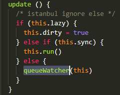
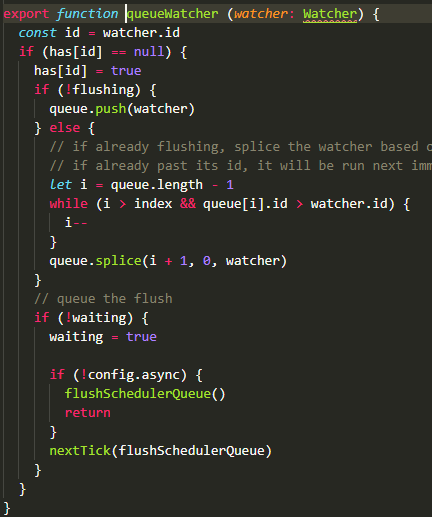
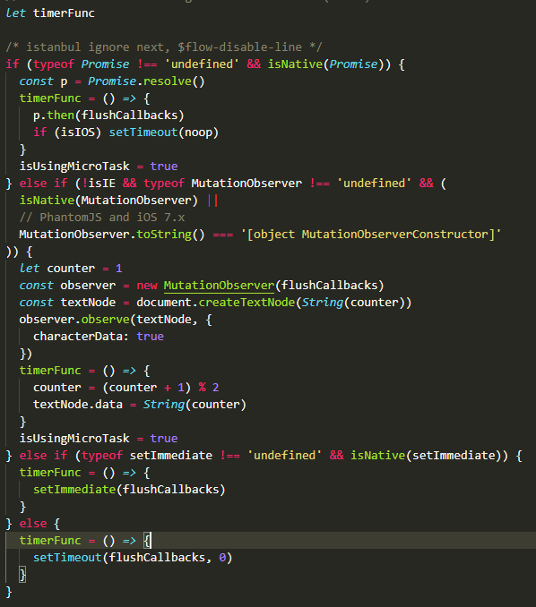
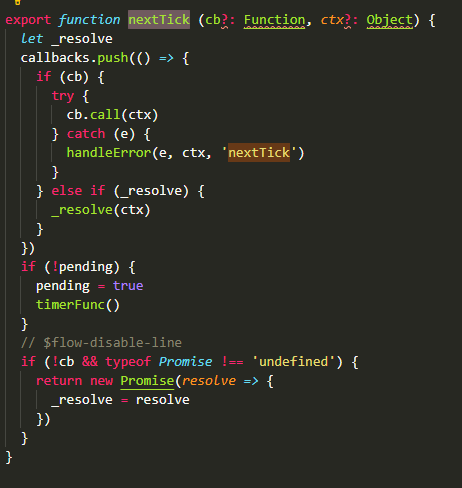
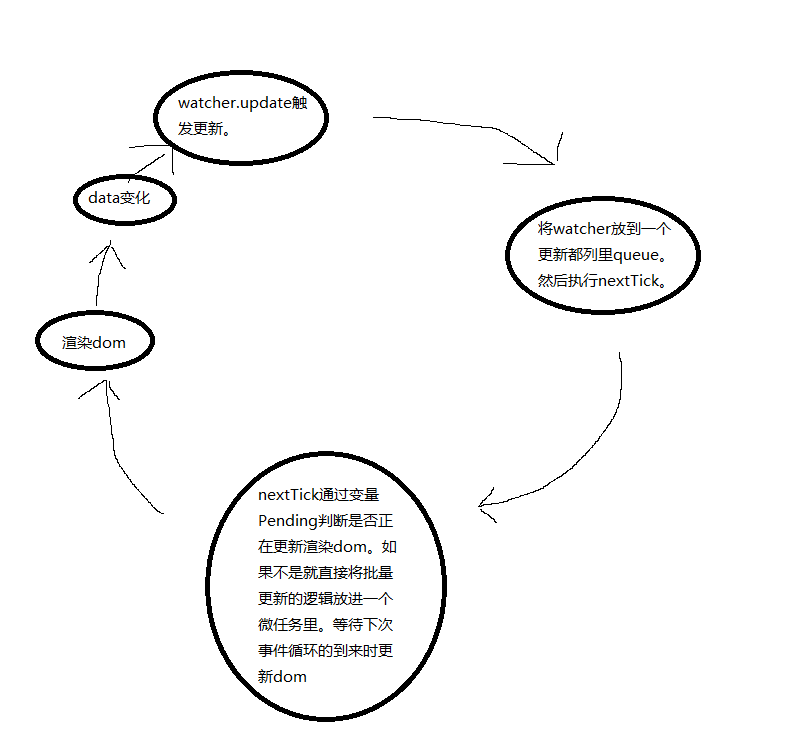

# 关于Vue的nextTick!!!
## 为什么需要nextTick?
首先Vue的数据响应式的。数据驱动页面改动的。既只要数据有所变动就会重新渲染dom更新到页面上。那。想到一个情况就是假设我在某个方法里多次修改一个数据。那岂不是会触发多次渲染。比如  
````
  mounted() {
    for(let i = 0;i < 100;i++) {
      this.number++
    }
  }
````
如上代码我们在Vue的mounted生命周期钩子修改数据100次。按理来说是要触发100次重新渲染更新的。但是其实最终我们只要修改100次之后的number值就可以了。这就是nextTick所要干的事。
## 深入nextTick实现。
首先我们看nextTick是在哪里调用的：  



可以看到会把个响应更新的watcher加入到queue都列中。然后根据waiting变量判断是否只正执行更新渲染中。 如果不是就直接执行nextTick并且传入更新逻辑就是flushSecheduleQueue方法，该方法会循环queue队列运行每个watcher求值并重新渲染dom；
nextTick源代码：


  

首先为了在下次事件循环之前更早的更新渲染dom我们就需要创造一个微任务（microTask）,因为在事件循环机制里 微任务会总在事件循环结束下次循环开始之前且在浏览器更新渲染之前优先执行。
可以看到在Vue的源码里优先判断了是否支持Promise.如果是就直接Promise.reslove()一个已完成的promise.并把then方法封装在一个函数里存给变量timerFunc;
在nextTick函数体里能看到 每次把传进来的更新逻辑都存在一个数组里。并且根据变量pending变量判断是否正在运行nextTick函数。如果不是就直接运行timeFunc函数。这样当前的总更新队列就会在当前的主线程执行栈为空后直接运行微任务里更新队列里的所有更新。
### 一图胜千言  
    
这就是为什么官方文档里的描述会是这样  
```
var vm = new Vue({
  el: '#example',
  data: {
    message: '123'
  }
})
vm.message = 'new message' // 更改数据
vm.$el.textContent === 'new message' // false
Vue.nextTick(function () {
  vm.$el.textContent === 'new message' // true
})
```
因为异步更新只会在当前执行栈的代码运行完之后在下一次事件循环才会更新DOM.之后才能拿到值的原因.